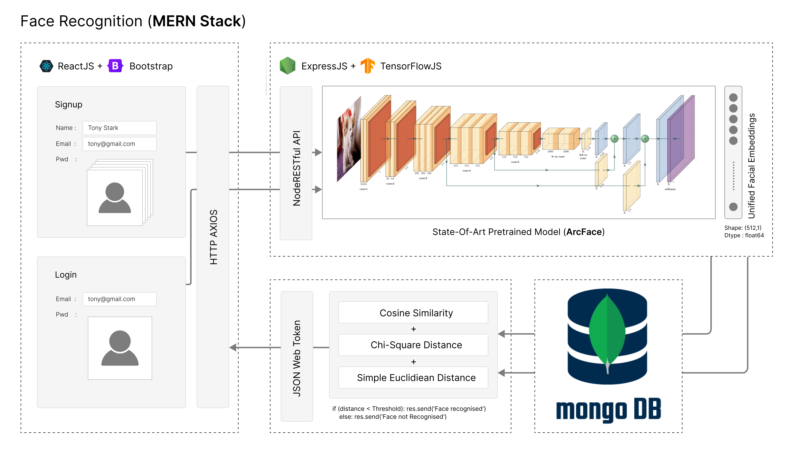
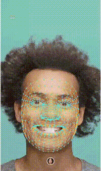
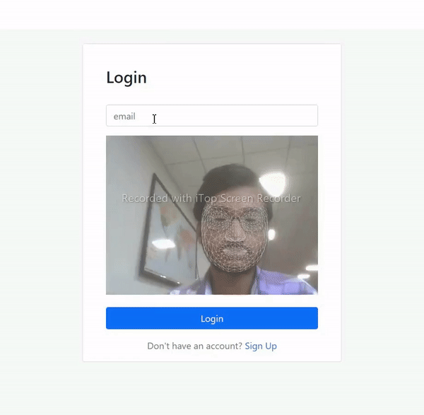

# Three Factor Authentication
#### Add an additional layer of security to the old 2FA, using Facial Biometric Scan
### Imp Links
- Microsoft Azure: https://microsoft-engage-facerecognition.azurewebsites.net
- Google GCP: https://engage-facerecognition.web.app
- Presentation: https://www.canva.com/design/DAFB4UYeqUo/qN1cLW12dbMYeyC01oamKg/view
- Linktree (All Links): https://linktr.ee/microsoft_engage_facerecog


# Table of Content
- [Abstract](#abstract)
- [Approach](#approach)
- [Introduction](#introduction)
- [Architecture](#architecture)
- [Tech Stack](#tech-stack)
    - [Frontend](#frontend)
    - [Backend](#backend)
    - [Database](#database)
- [Deployment](#deployment)
    - [Production](#production)
    - [Development](#development)
    - [Run Locally](#run-locally)
- [Key Features](#key-features)
- [Demo](#demo)
- [Citation](#citation)


# Abstract
Presently the risk of Cyber Attacks has increased a lot, and there is'nt any Technology that can withstand. Do you know how frequently malicious hackers attack our data and privacy? Every 39 seconds! According to reliable estimates, Cybercrimes are expected to cost the world around 6 trillion dollars annually by 2021.  Shocking, right? During last year, over 10 billion data breaches were recorded worldwide, And 79% of companies have experienced at least one in the past 18 months.

So it's clear that you need something more to protect your Data and Privacy, and my Project could provide an additional layer of security to all those systems which are more venerable to cyber thefts. I had implemented a nodeRESTfulAPI, where my API can be incorporated into any web application or a native android application, securely authenticating a session.

# Approach
 I have implemented a three-factor authentication system, which provides an additional layer security to the old 2FA, with the help of Facial Recognition.

- **Factor-1:** Basic Email + Password Authentication.
- **Factor-2:** Use Microsoft authenticator to scan QR-Code, generate a TOTP.
- **Factor-3:** Facial Biometrics of the user were used to validate his presence.
<!-- In the first step basic user info were taken along with password, In the second step first user has to scan the qr code using any authenticator app to register himself and then has to input correct totp in time generated by this authenticator, In the third step  -->
# Introduction
I had built a React engine to handle Frontend and Bootstrap to design UI. Now coming to the signup, we will take the basic user info name, email but instead of password we collect 5 to 10 snapshots of user in different poses. And similarly in login we collect email and a single snapshot of user. I have used axios to send post request to the API endpoint.

Now coming to the Backend part I have implemented a Node RESTful API, So that it can be incorporated into any web or an android application. I had used an extraordinary state of art deep learning model called ArcFace. And this model was released in 2019 by Jiankang Deng and his team. The model takes an image as an input and outputs a tensor of shape (512,1) and dtype float64. And I had used Tensorflow.js to run inference of this model on node backend. 

These outputs were called unified facial embeddings. They were send into our NoSQL database MongoDB along with the user info.

And now comes the recognition part, I am using Cosine Similarity, Chi-Square Distance, Simple Euclidean Distance, to compare vector form database with the one generated during login. And If the distance is less than a threshold, face is recognized send a cookie setting status to 200, else send an error setting status to 400, and I have used json web token to handle authentication part.
# Architecture
[](https://www.figma.com/file/7zmI0oLfl8JrWI6OjIU0mm/Microsoft-Engage-FaceRecognition)
<div align="center">I have used figma to implement this nice design, and the link for the file is <a src="https://www.figma.com/file/7zmI0oLfl8JrWI6OjIU0mm/">here</a></div>

# Tech Stack

### Frontend
- The whole UI of frontend was implemented with **`React`**, **`Bootstrap`**.
- And **`mediapipe`** is used for generating Facial Mesh and Bounding Boxes.
### Backend
- And the backend part was handled by **`Node`** + **`Express`**.
-  **`Json Web Token`** is used for handling Authentication.
-  **`TensorFlow.js`** for running model inference in javscript engine.
### Database
-  **`Mongoose`** (ODM) for sending queries to MongoDB (NoSQL database).
-  **`multer`** for file handling, and **`axios`** for sending HTTP requests.

# Deployment
### Production
- **Microsoft Azure**: https://microsoft-engage-facerecognition.azurewebsites.net
- **Google GCP**: https://engage-facerecognition.web.app
- **Heroku**: https://microsoft-engage-face-recog.herokuapp.com
- **Netlify**: https://microsoft-engage-facerecognition.netlify.app
- **Vercel**: https://microsoft-engage-face-recognition-client.vercel.app
### Development
- **Gitpod:** https://gitpod.io/#snapshot/1ee51682-59c1-4b35-a4d3-0de033c30a76
- **CodeSandbox:** https://codesandbox.io/s/microsoft-engage-facerecognition-64f31u
- **Glitch**: https://glitch.com/edit/#!/microsoft-engage-facerecognition
### Run Locally
- <b>Start Server</b>

  ```
  $ yarn install
  $ node app.js
  ```
- <b>Start Client</b>

  ```
  $ cd client
  $ yarn install
  $ yarn start
  ```
# Key Features
**3FA = Facial Biometric Authentication + The old 2FA**
<p style="width: 100%;"> 




</p>

- Scan Face and Securely send Biometrics to api endpoint
- Facial Mesh Generation
- Facial Landmarks Detection
- BoundingBox Detection
- Object Tracking
- Common Facial Characters Recognition
    - Age
    - Gender
    - Mood
    - Religion
    - Nationality
    - Race 
    - ..........

# Demo
<p align="center" width="100%">
    
 
</p>
<p align="center" width="100%">


</p>

# Citation
- ArcFace arXiv Official Paper, https://arxiv.org/abs/1801.07698
- InsightFace Repository from DeepInsight (ArcFace official release), https://github.com/deepinsight/insightface
- YOLOv5 Ultralytics Official gitHub Repository, https://ultralytics.com/yolov5
- YOLOv5 trained on CrowdHuman Dataset, https://github.com/deepakcrk/yolov5-crowdhuman
